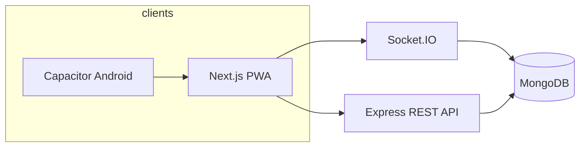
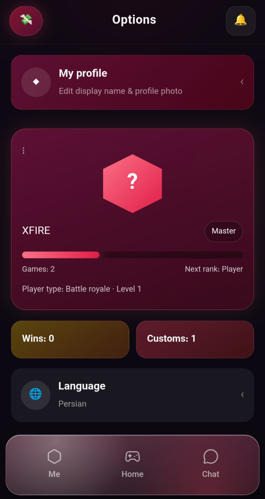
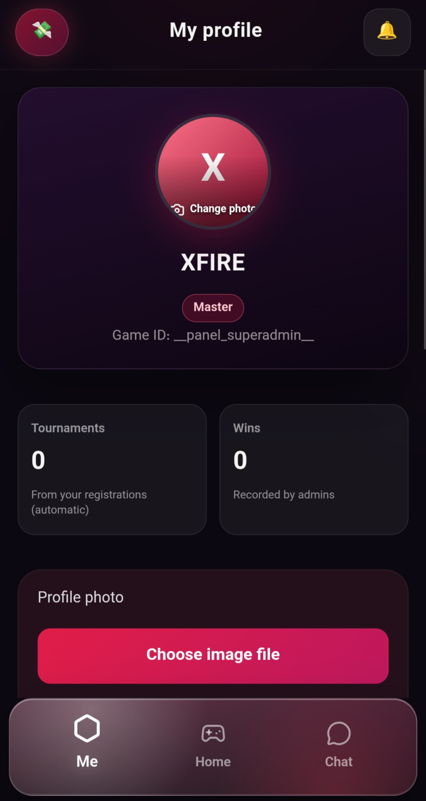
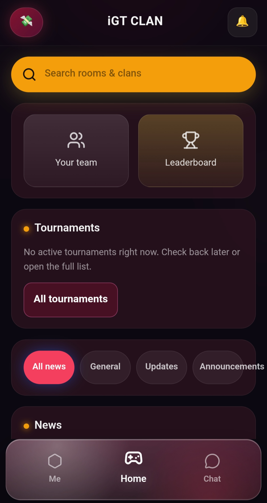
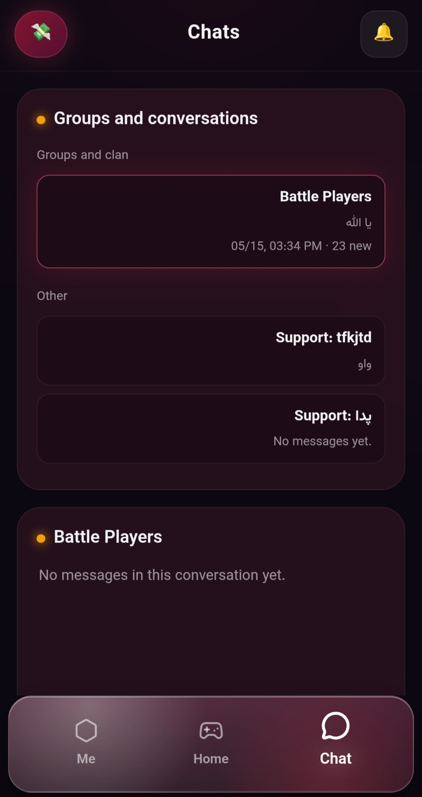
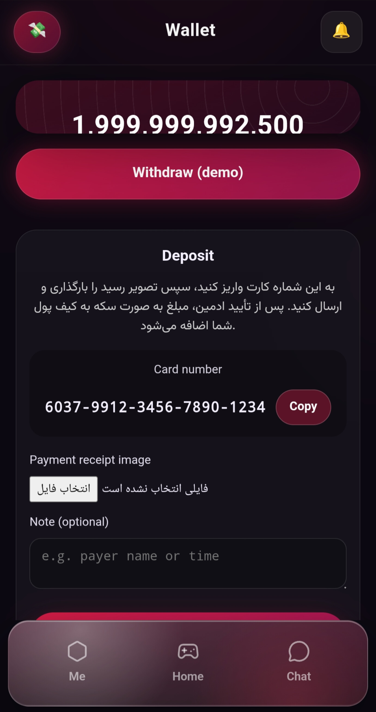
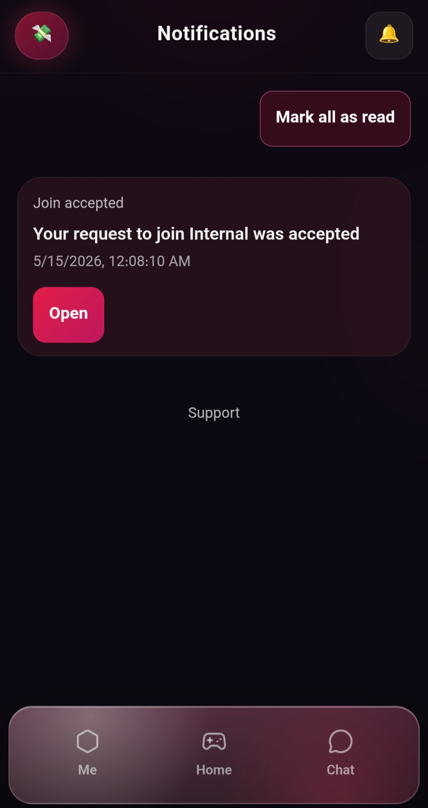
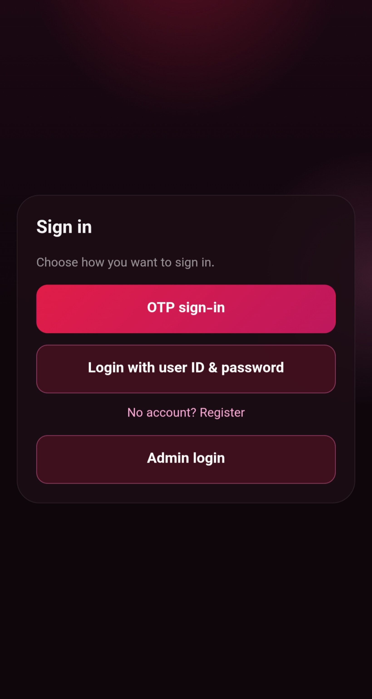

# iGT CLAN — Case Study

**Private client project** · Mobile-first clan platform for a live gaming community (production web + Android shell).

**Live:** [https://igtclan.ir](https://igtclan.ir)

---

## Summary

End-to-end product for clan members and operators: authentication, profile and wallet, clan discovery, real-time chat, tournaments and news, plus a permissioned admin panel. Built for phones first (PWA install, RTL/LTR), with Docker-based deployment and a Capacitor Android wrapper pointing at the production site.

| | |
|---|---|
| **Role** | Full-stack development & deployment |
| **Stack** | Next.js · Express · Socket.IO · MongoDB · Docker · Capacitor |
| **Live** | [https://igtclan.ir](https://igtclan.ir) |

---

## Problem

The clan needed a single place for members to stay informed, coordinate in teams, manage in-app balance, and compete—without relying on scattered chats and manual admin spreadsheets. Operators needed safe tools to moderate users, publish news, and approve wallet deposits.

---

## Solution

A unified app with a consistent mobile shell, bilingual UI (Persian / English), and a clear split between member flows and admin capabilities.

**Member experience**

- Email and OTP sign-in, profile with avatar and language toggle  
- Home hub: news feed, tournaments, clan search, wallet balance  
- Clan pages, invites, and team coordination  
- Real-time chat (Socket.IO)  
- Wallet: balance, deposit requests with proof upload  
- Push-style in-app notifications  

**Operations**

- Admin dashboard: users, news, tournaments, wallet deposit review  
- Granular panel credentials (not a single shared admin password in production)  
- Super-admin separation for sensitive actions  

**Delivery**

- Monorepo: `frontend` (Next.js) + `backend` (Express API)  
- `docker-compose` for MongoDB + API + UI on a VPS  
- Capacitor Android app loading [https://igtclan.ir](https://igtclan.ir)  

---

## Architecture



---

## Screenshots

Gallery (capture order). All data shown is from staging/demo or redacted client content.

### 01 — Splash & entry



### 02 — Home & news



### 03 — Clan & members



### 04 — Chat



### 05 — Wallet



### 06 — Tournaments & profile



### 07 — Admin / settings



---

## Technical highlights

- **Auth**: JWT sessions; email/password and SMS OTP paths  
- **Realtime**: Socket.IO rooms aligned with chat domains  
- **i18n**: Locale in `localStorage`, document `dir` / `lang` for FA and EN  
- **Uploads**: Avatar and wallet proof handling on the API with static serving behind the reverse proxy  
- **Ops**: Health check endpoint, integration tests on critical API flows  

---

## Note on source code

This repository is a **portfolio showcase** (screenshots + write-up only). Application source and infrastructure secrets are **not** published; they remain private under the client engagement.

---

## Contact

For a technical walkthrough or similar work, reach out via your portfolio contact channel.

---

## Publish to GitHub (maintainer)

From this folder, after [GitHub CLI](https://cli.github.com/) login:

```powershell
gh auth login
.\push-to-github.ps1
```

Creates **https://github.com/Satan2049/igtclan-showcase** (public) and pushes `main`.
